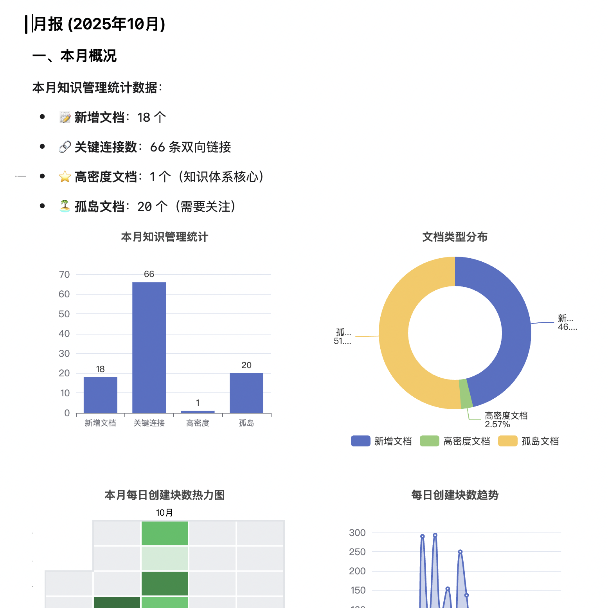

# Quick Switch - 快速切换插件

[English](#english) | [简体中文](#简体中文) 

---

## 简体中文

一个为思源笔记设计的快速切换插件，提供快速标签切换、文档搜索、文档内搜索和快速提醒等功能。

### 更新记录(v0.3.4)

- 修复部分Bug，优化了文内搜索的体验以及部分交互体验
- 新增**最近笔记功能**：按`!`可查看最近更新的5个文档
- 新增**一键生成日报、周报、月报功能**：需要在设置中配置api，推荐使用deepseek
  - 注意：为了使上传到ai的信息是可选取的，避免部分信息泄漏，故日报、周报只筛选带时间戳（如2025-10-16 15:55:12）的块及其子块，而月报仅上传月度文档的标题。
  - 日报功能: 日报聚焦于今日任务，使用ai整理今日的碎片信息。
    -
  - 周报功能：周报聚焦于一周的产出，使用ai整理笔记的主题，尝试形成长期笔记。
    -
  - 月报功能：月报强调长期的笔记文档分析，该部分会本地分析月度新建文档的信息，并生成可视化图表，并且会将所有笔记（除了daily中的日记）的标题及双链数发送至ai。
    -

### ✨ 功能特性

- ⚡ **快速标签切换**：一键切换已打开的文档标签页
- 🔍 **文档搜索**：全局搜索所有文档，支持模糊匹配
- 🎯 **文档内搜索**：在当前文档中搜索并高亮关键词
- ⏰ **快速提醒**：快速创建任务提醒（需要任务笔记管理插件 https://github.com/Achuan-2/siyuan-plugin-task-note-management）
- 📝 **快速日记**：一键插入内容到今日日记
- ⌨️ **键盘导航**：完整的键盘导航支持
- 🎨 **现代化界面**：美观直观的用户界面

### 📖 使用方法

#### 触发快速切换
- 点击顶栏图标 🔍
- 使用快捷键：`⌘O` (Mac) 或 `Ctrl+O` (Windows/Linux)

#### 快捷键操作
- `↑` / `↓`：在结果中导航
- `Enter`：打开选中的文档
- `⌘Enter` / `Ctrl+Enter`：将内容插入到今日日记
- `Alt+Enter`：创建快速提醒
- `Tab`：切换到文档内搜索模式
- `Esc`：关闭快速切换面板

#### 功能说明
- 已打开的文档会显示 ✓ 标记
- 已打开的文档会优先显示在搜索结果顶部
- 模糊匹配支持部分文本和路径匹配
- 实时搜索，带防抖优化

### ⚙️ 设置

通过插件设置面板可以配置：
- **搜索范围**：选择搜索所有笔记本、当前笔记本或自定义选择
- **显示选项**：切换路径显示和设置最大结果数
- **笔记本设置**：配置默认笔记本和日记笔记本

### 📦 安装

#### 从集市安装（推荐）
1. 打开思源笔记
2. 进入 `设置` → `集市` → `插件`
3. 搜索 "快速切换" 或 "Quick Switch"
4. 点击 `下载` 并启用

#### 手动安装
1. 从 [Releases](https://github.com/asdfcyt/sy-quickswitch/releases) 下载最新的 `package.zip`
2. 解压到思源笔记的 `工作空间/data/plugins/` 目录
3. 重启思源笔记或重新加载插件

### 🐛 问题反馈

如遇到问题或有功能建议，欢迎提交 [Issue](https://github.com/asdfcyt/sy-quickswitch/issues)。

感谢下面这些项目给予的参考与帮助：
https://github.com/Achuan-2/siyuan-plugin-task-note-management
https://github.com/TCOTC/siyuan-plugin-hsr-mdzz2048-fork

### 用爱发电

谢谢你的喜欢,如果用着还不错，请一杯咖啡呗

### 📄 许可证

MIT License

---

## English

A quick switcher plugin for SiYuan Note, providing quick tab switching, document search, in-document search, and quick reminders.

### ✨ Features

- ⚡ **Quick Tab Switching**: Switch between opened document tabs
- 🔍 **Document Search**: Search all documents with fuzzy matching
- 🎯 **In-Document Search**: Search and highlight keywords in current document
- ⏰ **Quick Reminders**: Create task reminders quickly (requires task management plugin)
- 📝 **Quick Journal**: Insert content to today's journal with one click
- ⌨️ **Keyboard Navigation**: Full keyboard support
- 🎨 **Modern UI**: Beautiful and intuitive interface

### 📖 Usage

#### Trigger Quick Switcher
- Click the lightning icon ⚡ in the top bar
- Use keyboard shortcut: `⌘O` (Mac) or `Ctrl+O` (Windows/Linux)

#### Keyboard Shortcuts
- `↑` / `↓`: Navigate through results
- `Enter`: Open selected document
- `⌘Enter` / `Ctrl+Enter`: Insert to today's journal
- `Alt+Enter`: Create quick reminder
- `Tab`: Switch to in-document search mode
- `Esc`: Close quick switcher

#### Features
- Opened documents are marked with ✓
- Opened documents appear at the top
- Fuzzy matching supports partial text and path
- Real-time search with debouncing

### ⚙️ Settings

Configure through plugin settings:
- **Search Scope**: All notebooks, current notebook, or custom selection
- **Display Options**: Toggle path display and set maximum results
- **Notebook Settings**: Configure default notebook and journal notebook

### 📦 Installation

#### From Marketplace (Recommended)
1. Open SiYuan Note
2. Go to `Settings` → `Marketplace` → `Plugins`
3. Search for "Quick Switch"
4. Click `Download` and enable

#### Manual Installation
1. Download latest `package.zip` from [Releases](https://github.com/asdfcyt/sy-quickswitch/releases)
2. Extract to `workspace/data/plugins/` directory
3. Restart SiYuan Note or reload plugins

### 🐛 Issue Reporting

If you encounter issues or have feature suggestions, please submit an [Issue](https://github.com/asdfcyt/sy-quickswitch/issues).

Due to closed source, Pull Requests cannot be accepted at this time, but suggestions and feedback are very welcome.

### 📄 License

MIT License

