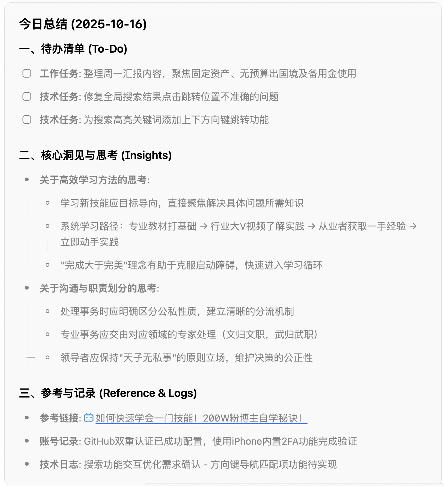
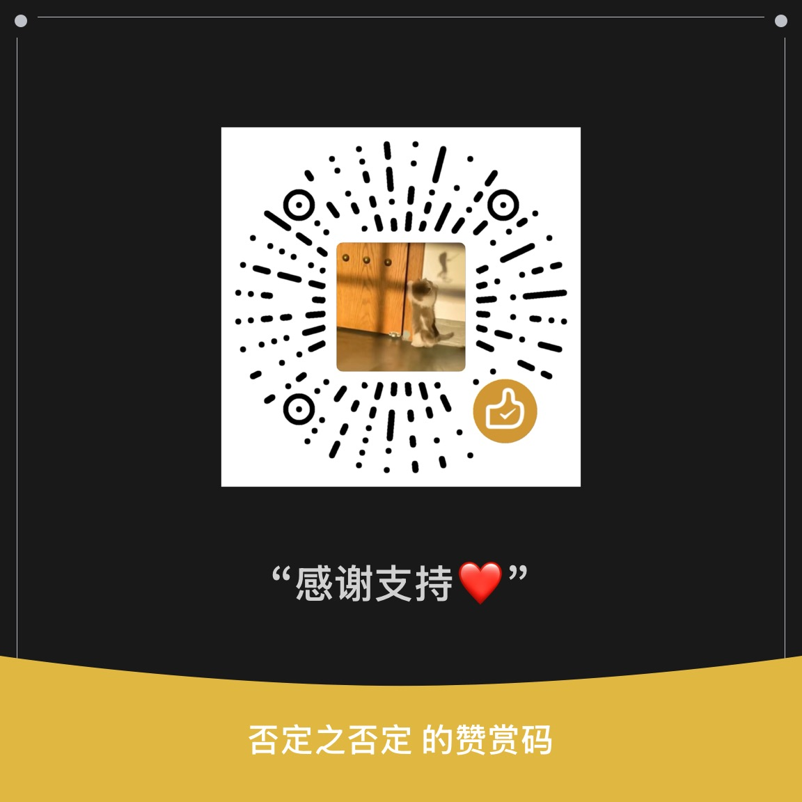

# 快速切换插件

一个为思源笔记设计的插件，提供快速切换已打开标签页、文档搜索和文档内搜索功能，类似 Obsidian 的快速切换功能。

## 更新记录(v0.3.3)

- 修复部分Bug，优化了文内搜索的体验以及部分交互体验
- 新增**最近笔记功能**：按`!`可查看最近更新的5个文档
- 新增**一键生成日报、周报、月报功能**：需要在设置中配置api，推荐使用deepseek
  - 注意：为了使上传到ai的信息是可选取的，避免部分信息泄漏，故日报、周报只筛选带时间戳（如2025-10-16 15:55:12）的块及其子块，而月报仅上传月度文档的标题。
  - 日报功能: 日报聚焦于今日任务，使用ai整理今日的碎片信息。
    -
  - 周报功能：周报聚焦于一周的产出，使用ai整理笔记的主题，尝试形成长期笔记。
    -
  - 月报功能：月报强调长期的笔记文档分析，该部分会本地分析月度新建文档的信息，并生成可视化图表，并且会将所有笔记（除了daily中的日记）的标题及双链数发送至ai。
    -

## ✨ 功能特性

- 🚀 **快速标签切换**：使用键盘快捷键快速切换已打开的文档
- 🔍 **文档搜索**：使用模糊匹配搜索所有文档
- 🎯 **文档内搜索**：在当前文档中搜索关键词并高亮显示
- ⏰ **快速提醒**：快速创建任务提醒，支持优先级和多种提醒类型
- 📝 **快速插入日记**：一键将内容插入到今日日记

## 📖 使用方法

### 快速切换文档

**触发方式**：
- 点击顶栏图标 🔍
- 使用键盘快捷键：`⌘+O`（Mac）或 `Ctrl+O`（Windows/Linux）

**导航操作**：
- `↑` / `↓`：在结果中导航
- `Enter`：打开选中的文档
- `⌘Enter` / `Ctrl+Enter`：将内容插入到今日日记
- `Alt+Enter`：创建快速提醒
- `Tab`：切换到文档内搜索模式
- `Esc`：关闭快速切换面板

**功能说明**：
- 已打开的文档会显示 ✓ 标记
- 已打开的文档会优先显示在搜索结果顶部
- 模糊匹配支持部分文本和路径匹配
- 实时搜索，带防抖优化以提升性能

### 文档内搜索
**触发方式**：
- 点击顶栏的查找图标
- 使用键盘快捷键：`⌘+⇧+F`（Mac）或 `Ctrl+Shift+F`（Windows/Linux）

**操作说明**：
- 输入关键词，自动高亮所有匹配项
- `Enter`或者`⬆️`：跳转到下一个匹配项
- `Shift+Enter`或者`⬇️`：跳转到上一个匹配项
- `Esc`：关闭搜索面板并清除高亮

**功能特点**：
- ✨ 实时搜索和高亮
- 🎨 普通匹配项：黄色背景高亮
- 🎯 当前匹配项：橙色背景 + 外发光效果
- 📊 显示匹配数量和当前位置（如 "3 / 10"）
- 🔄 自动滚动到当前匹配项
- 🌐 支持中文、英文和特殊字符

### 快速提醒

**前置要求**：
- ⚠️ 需要安装 [任务笔记管理插件](https://github.com/Achuan-2/siyuan-plugin-task-note-management)

**触发方式**：
- 在快速切换面板输入提醒标题
- 按 `Alt+Enter` 直接创建提醒（无需二次确认）

**功能特点**：
- ⚡ **一键创建**：输入标题按快捷键即可，无需填写表单
- ⏰ **智能时间**：自动设置为当前时间 + 1小时
- 🟡 **默认优先级**：创建为中等优先级
- 💾 **数据共享**：直接保存到任务管理插件的存储
- 🔗 **无缝集成**：可在任务管理插件中查看和管理
- ✅ **即时反馈**：显示创建成功提示

**使用示例**：
1. 打开快速切换（⌘O / Ctrl+O）
2. 输入：`完成项目报告`
3. 按 `Alt+Enter`
4. 看到：`🟡 提醒创建成功！`
5. 在任务管理插件中查看新提醒

### 快速插入日记

**触发方式**：
- 在快速切换面板输入内容
- 按 `⌘Enter`（Mac）或 `Ctrl+Enter`（Windows/Linux）

**功能特点**：
- ⚡ 一键插入到今日日记
- 🕐 自动添加当前时间（加粗格式）
- ⚙️ 可在设置中配置日记笔记本

## 设置

通过插件设置面板访问配置：

- **搜索范围**：选择搜索所有笔记本、当前笔记本或自定义选择
- **显示选项**：切换路径显示和设置最大结果数
- **快捷键**：自定义键盘快捷键
- **AI配置**：推荐使用deepseek

## 

谢谢你的喜欢,如果用着还不错，请一杯咖啡呗

## 许可证

MIT

